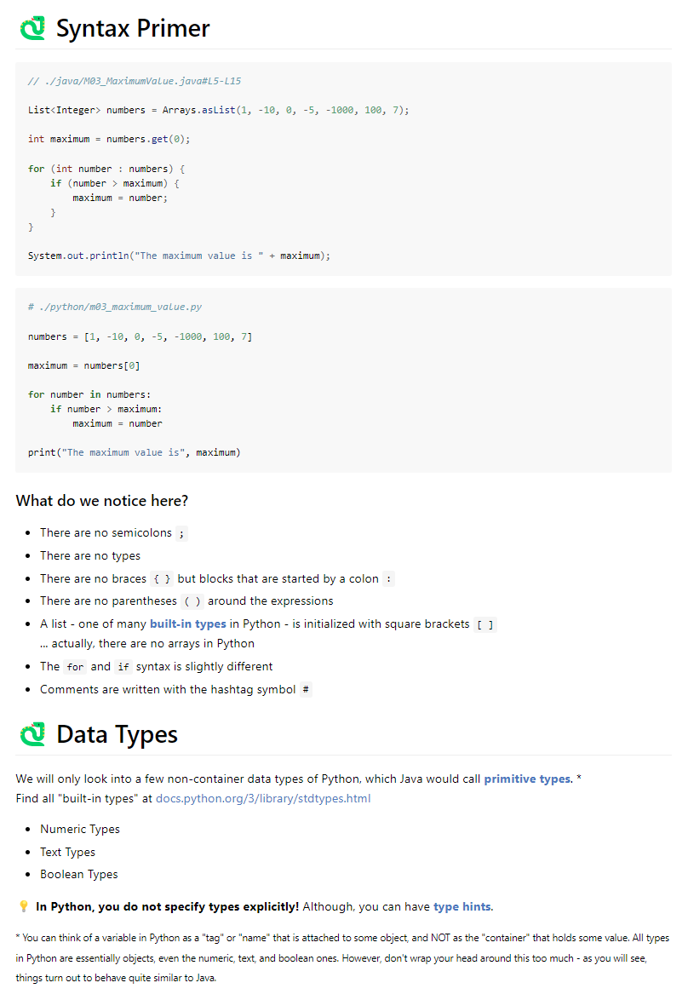
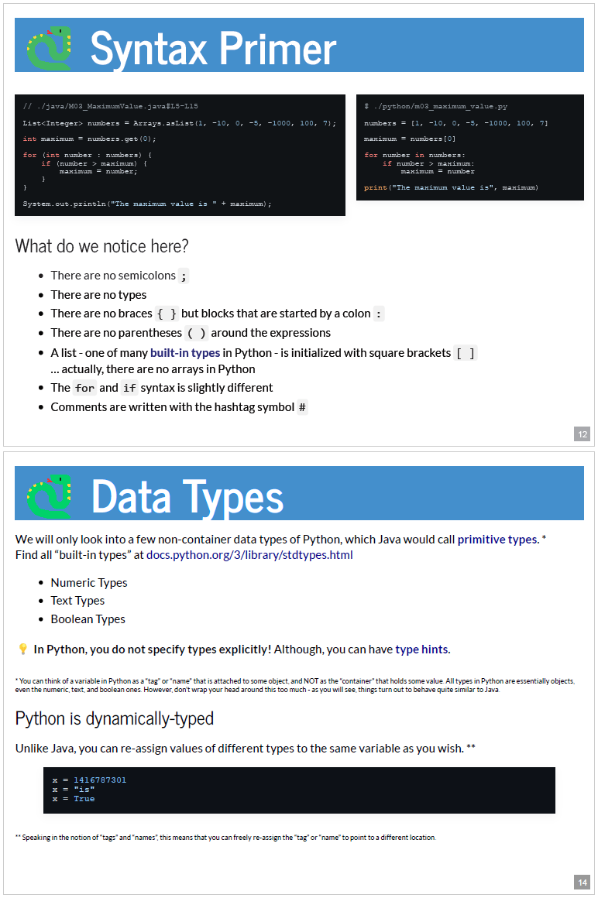
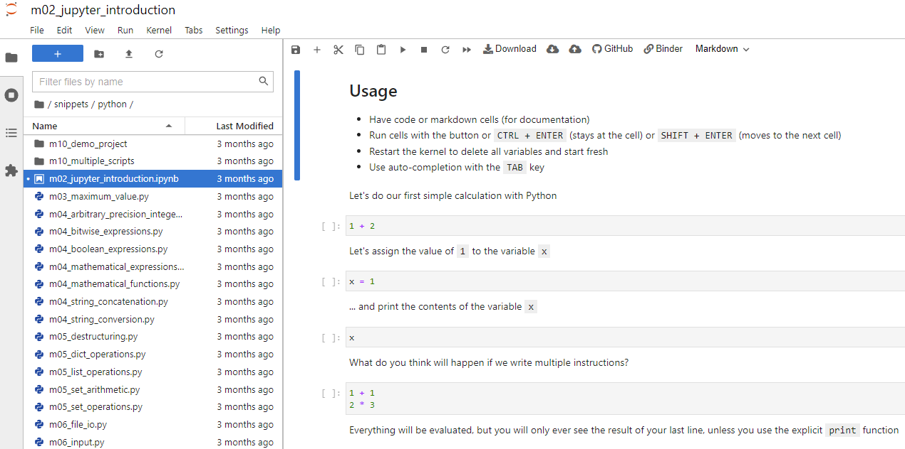

# Python Crash Course for Java Developers

If you are a Java developer and want to get a quick glance at Python, this course is for you.

| Course [excerpt](https://blu3r4y.github.io/python-for-java-developers/excerpt.html)                                      | Course [slides](https://blu3r4y.github.io/python-for-java-developers/) or [PDF view](https://blu3r4y.github.io/python-for-java-developers/?print-pdf) |
| ------------------------------------------------------------------------------------------------------------------------ | ----------------------------------------------------------------------------------------------------------------------------------------------------- |
|  |                                             |

## Interactive Course Guide

You can follow along by just viewing the slides or the excerpt.  
If you would like to have PDF slides, press the PDF button and head to your print dialog.

If you want to play around with the code snippets in a Jupyter notebook, do one of the following.

### Option A: Open a JupyerLab environment with Binder (recommended)

**Click the Binder button** above to launch a pre-configured JupyterLab instance in your browser.

### Option B: Install and run Python on your computer (local setup)

[Install Python](https://www.python.org/) locally, check-out this repository, install the dependencies and start a JupyterLab instance.

    python -m pip install -r requirements.txt
    python -m jupyter lab --notebook-dir .

If you have [VS Code](https://code.visualstudio.com/), you can also open notebooks directly in there.

### Option C: Use GitHub.dev with Pyodide (experimental)

**Press the `.` button on your keyboard** and install the `vscode-pyodide` extension for Jupyter support.
