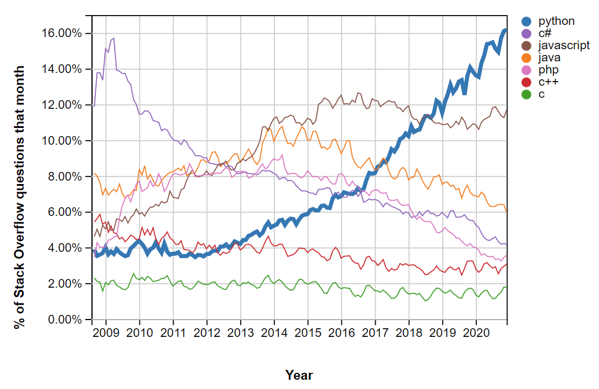

<!-- .slide: id="-what-is-python" -->

# 🐍 What is Python?

<!-- .element: class="headline" -->

 <!-- .element style="height: 5em; margin-bottom: -1em;" -->

Python is a **mature, general-purpose, object-oriented, dynamically-typed** programming language.

- released in 1991, four years before Java
- dominant in machine learning, statistics, and data analytics
- popular alternative to MATLAB or Octave
- gaining in popularity year after year

 <!-- .element style="height: 15em;" -->

---

## Comparison to Java

### Similarities

- general-purpose, both having a large standard library
- object-oriented
- garbage-collected

### Differences

- **dynamically-typed**, and not strongly-typed  
  _("type checks will only happen at runtime")_
- **interpreted with [CPython](https://github.com/python/cpython)**, and not just-in-time compiled with a JVM  
  _("more flexibility, but slower execution times")_
- **interactive mode** provided out of the box  
  _("i will show you that soon")_
